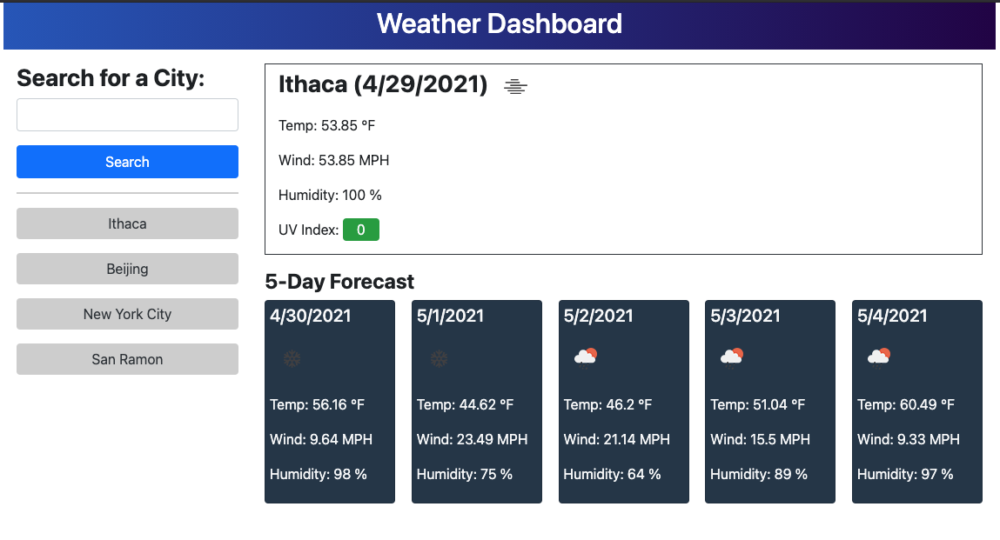
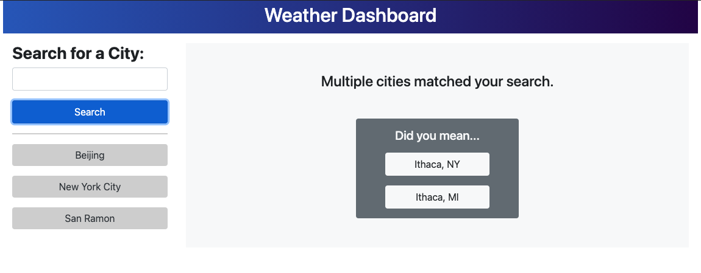

# Weather Dashboard
An app to fetch and display weather information from OpenWeather for multiple cities to aid travelers in trip planning.

## Features
- Provides a simple search form that accepts a city name
- Searching for a city presents the user with current and future conditions for that city, if found
- Searched cities are recorded, and the last 10 cities search are accessible via buttons below the search form
- Selecting a city in the search history displays the current and future conditions for that city as of the current date
- The dashboard is pre-populated with weather conditions for the most recently search city, when the app is loaded
- Current weather conditions for a city are dispayed with the city name, current date, an icon representing the weather conditions, temperature, humidity, wind speed, and UV index
- The UV index is styled with a color that indicates whether the conditions are favorable, moderate, or severe
- Future weather conditions for the city are presented as a 5-day forecast that includes the date, an icon representing the weather conditions, temperature, wind speed, and humidity for each day

## Screenshot
&nbsp;&nbsp;

